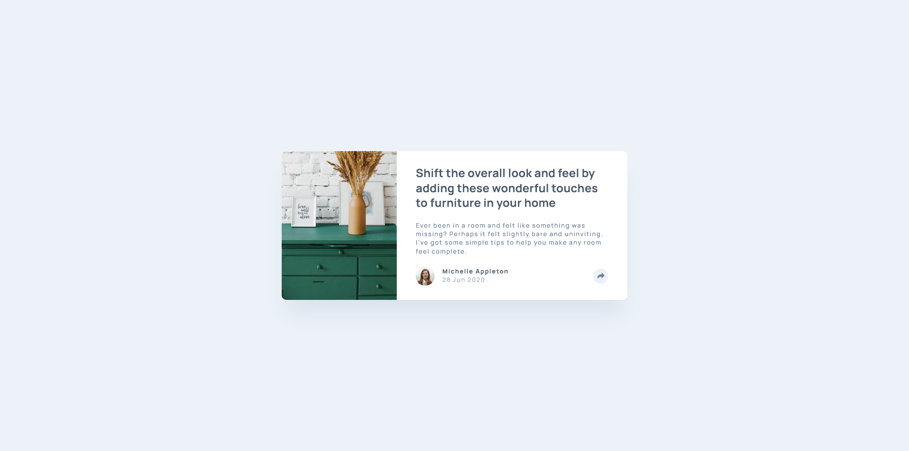

# Frontend Mentor - Article preview component solution

This is a solution to the [Article preview component challenge on Frontend Mentor](https://www.frontendmentor.io/challenges/article-preview-component-dYBN_pYFT). Frontend Mentor challenges help you improve your coding skills by building realistic projects. 

## Table of contents

- [Overview](#overview)
  - [The challenge](#the-challenge)
  - [Screenshot](#screenshot)
  - [Links](#links)
  - [Built with](#built-with)
  - [What I learned](#what-i-learned)
  - [Continued development](#continued-development)
  - [Useful resources](#useful-resources)
- [Author](#author)

## Overview

Aside from HTML and CSS, this project also uses JavaScript to toggle a UI's visibility. In this project, I was able to gain some foundational knowledge about JavaScript and how does it contribute to websites.

### The challenge

Users should be able to:

- View the optimal layout for the component depending on their device's screen size
- See the social media share links when they click the share icon

### Screenshot



### Links

- Solution URL: [https://www.frontendmentor.io/solutions/responsive-article-preview-component-with-sass-and-javascript-logic-LwBtz_WXK7](https://www.frontendmentor.io/solutions/responsive-article-preview-component-with-sass-and-javascript-logic-LwBtz_WXK7)
- Live Site URL: [https://schindlerdumagat.github.io/article-preview-component/](https://schindlerdumagat.github.io/article-preview-component/)

### Built with

- Semantic HTML5 markup
- CSS custom properties
- Flexbox
- CSS Grid
- Mobile-first workflow
- JavaScript
- [Sass](https://sass-lang.com/) - A CSS Preprocessor
- [BEM](https://getbem.com/) - A CSS Methodology


### What I learned

In this project, I was able to use JavaScript to show or hide a UI by clicking a button.

```js
const cardButton = document.querySelector('.card__btn');
const shareDialog = document.querySelector('.card__share-dialog');

cardButton.addEventListener("click", () => {
    if (!shareDialog.open) {
        shareDialog.show();
        cardButton.classList.add('card__btn--active');
    } else {
        shareDialog.close();
        cardButton.classList.remove('card__btn--active');
    }
})
```

### Continued development

I want to focus in improving on how I create a more accurate plan before diving in to coding. That includes inspecting the design and creating an html markup, utility classes and more useful stuff in my mind. This will allow me to create a more accurate solution and reduce the need to refactor a lot when things doesn't go as planned.

### Useful resources

- [Web.dev - JavaScript](https://web.dev/learn/javascript) - By reading this resource, I was able to gain the basic fundamentals of JavaScript.

## Author

- Website - [Schindler C. Dumagat](https://schindlerdumagat.github.io/webportfolio/)
- Frontend Mentor - [@schindlerdumagat](https://www.frontendmentor.io/profile/schindlerdumagat)
- LinkedIn - [@schindlerdumagat](https://www.linkedin.com/in/schindler-dumagat-015238230/)
